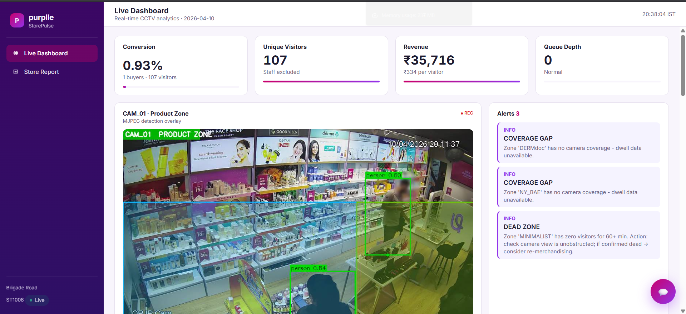
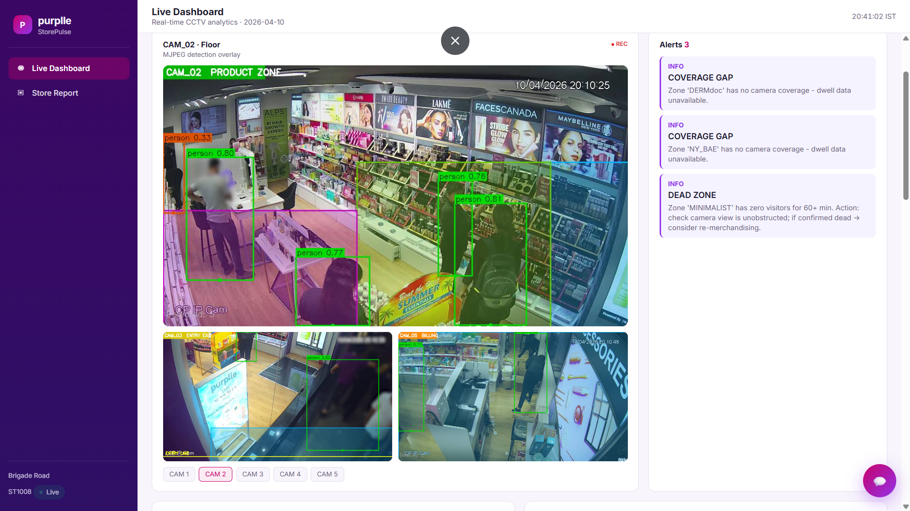
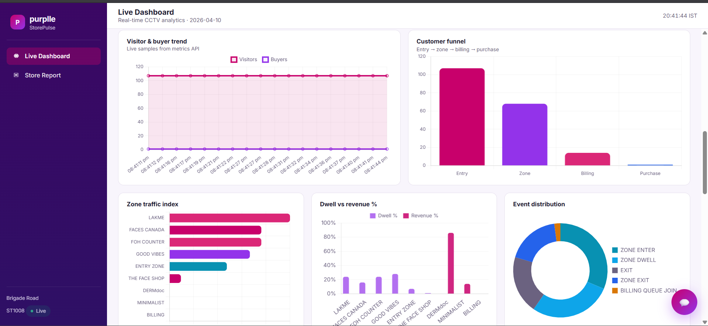
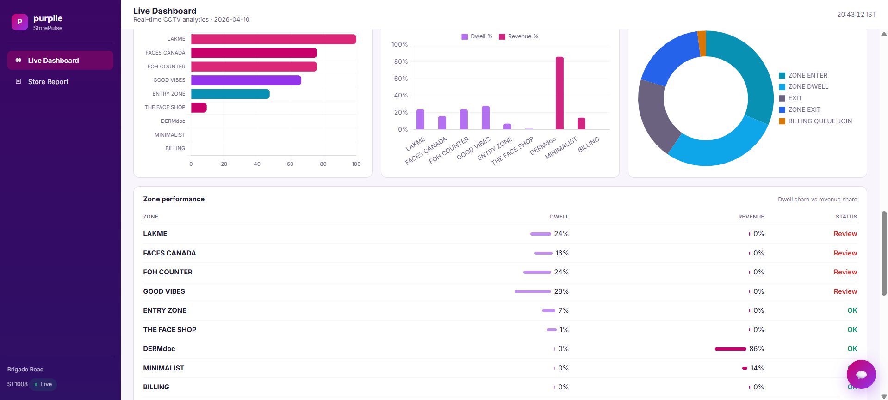
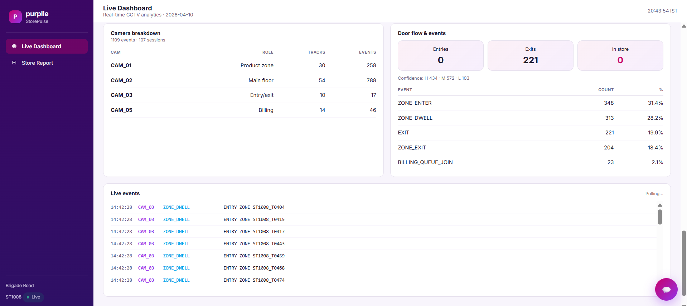
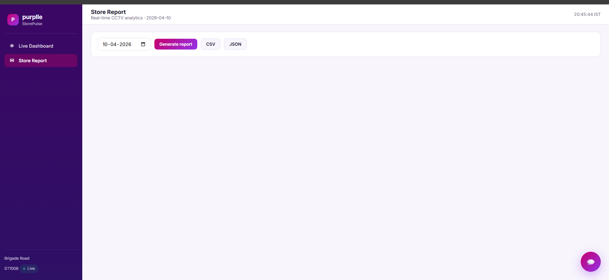
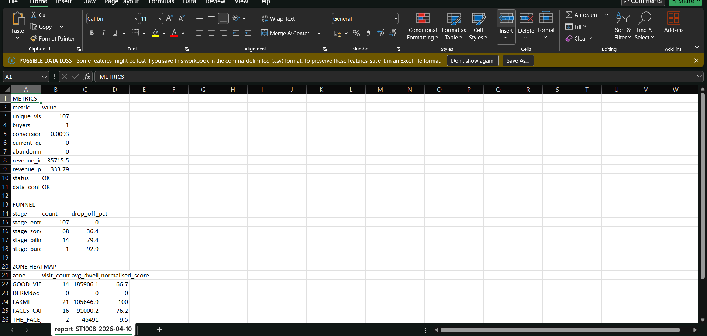
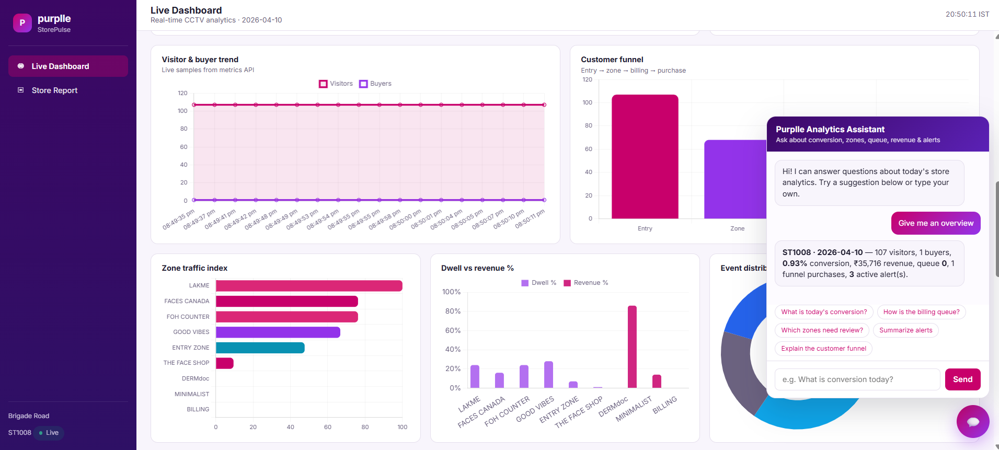

# StorePulse 🏪📊

### **Measure Every Visit. Understand Every Customer. Improve Every Sale.**

**AI-Powered Retail Intelligence Platform**

StorePulse transforms CCTV footage into actionable business intelligence using computer vision, visitor tracking, customer journey analytics, POS correlation, and real-time dashboards.

---

## Overview

StorePulse enables physical retail stores to gain the same level of customer intelligence that e-commerce platforms enjoy online.

Using existing CCTV infrastructure, StorePulse helps retailers understand customer behavior, optimize store layouts, improve conversion rates, reduce operational inefficiencies, and drive higher revenue through AI-powered insights.

### What StorePulse Delivers

* Real-time customer detection and tracking
* Visitor traffic analytics
* Customer journey mapping
* Dwell-time analysis
* Conversion rate measurement
* POS transaction correlation
* Operational anomaly detection
* Live dashboards and reporting

---

## Key Features

### AI Vision Engine

* YOLOv8-based customer detection
* ByteTrack multi-object tracking
* Visitor re-identification
* Cross-camera customer continuity
* Staff vs Customer classification
* Zone-level activity analysis
* Session generation and tracking

### Retail Intelligence

* Unique visitor counting
* Buyer conversion tracking
* Revenue attribution
* Customer journey analytics
* Zone performance heatmaps
* Queue monitoring
* Dead-zone identification
* Conversion-drop alerts
* Attention-to-sales gap analysis

### Real-Time Dashboard

* Live CCTV stream overlays
* KPI monitoring
* Interactive analytics
* Conversion funnel visualization
* Customer flow analytics
* Heatmap insights
* Alert management
* Downloadable reports

### Engineering Features

* FastAPI backend
* SQLite persistence layer
* REST APIs
* Docker deployment
* Server-Sent Events (SSE)
* Automated testing
* Configurable store layouts
* Scalable analytics architecture

---

## Dashboard Modules

### Executive Overview Dashboard

Monitor key business metrics in real time:

* Total Visitors
* Buyers
* Revenue
* Conversion Rate
* Revenue Per Visitor
* Average Dwell Time

### Live Store Monitoring

Track activity across the store:

* Real-time customer tracking
* Zone occupancy monitoring
* Queue length analysis
* Visitor movement tracking
* Live camera overlays

### Conversion Analytics

Understand how visitors become buyers:

* Visitor-to-Buyer Conversion
* Revenue Attribution
* Funnel Analysis
* Conversion Trends

### Customer Journey Analytics

Analyze customer behavior throughout the store:

* Entry → Browse → Engage → Purchase
* Session Analytics
* Journey Visualization
* Funnel Drop-off Insights

### Store Performance Heatmaps

Identify high-performing and underutilized areas:

* High Engagement Zones
* Low Engagement Zones
* Product Interaction Areas
* Store Traffic Distribution

---

## Dashboard Screenshots

### Dashboard Overview



### Live CCTV Analytics



### Conversion Analytics



### Customer Journey Funnel



### Zone Performance Analytics



### Report Storage



### CSV generated report



### Dahboard analytics



---

## System Architecture

```text
CCTV Cameras
      │
      ▼
YOLOv8 Detection
      │
      ▼
ByteTrack Tracking
      │
      ▼
Visitor Sessions
      │
      ▼
Event Generation
      │
      ▼
FastAPI Event API
      │
      ▼
SQLite Database
      │
      ▼
Analytics Engine
      │
      ▼
StorePulse Dashboard
```

---

## Tech Stack

### Backend

* FastAPI
* Pydantic
* Uvicorn

### Computer Vision

* YOLOv8
* ByteTrack
* OpenCV
* NumPy

### Analytics

* Pandas
* SQLite

### Deployment

* Docker
* Docker Compose

### Testing

* Pytest
* Coverage

---

## Project Structure

```text
StorePulse/
│
├── app/                  # FastAPI backend
├── pipeline/             # Detection & tracking pipeline
├── scripts/              # Utility scripts
├── config/               # Store configurations
├── data/                 # CCTV footage & POS datasets
├── tests/                # Automated tests
├── docs/                 # Design documentation
│
├── Dockerfile
├── docker-compose.yml
├── requirements.txt
└── README.md
```

---

## Quick Start

### Option 1: Docker Deployment

Clone the repository:

```bash
git clone <repo-url>
cd StorePulse
```

Build and start services:

```bash
docker compose up --build
```

Open:

```text
http://localhost:8000
```

API Documentation:

```text
http://localhost:8000/docs
```

---

### Option 2: Local Development

Create virtual environment:

```bash
python -m venv venv
```

Activate environment:

```bash
# Windows
venv\Scripts\activate

# Linux / Mac
source venv/bin/activate
```

Install dependencies:

```bash
pip install -r requirements.txt
```

Run API:

```bash
uvicorn app.main:app --reload
```

Open:

```text
http://localhost:8000
```

---

## Running the Analytics Pipeline

Start the backend first:

```bash
uvicorn app.main:app --reload
```

Run the CCTV analytics pipeline:

```bash
python scripts/run_pipeline.py --api http://127.0.0.1:8000
```

The pipeline will:

1. Read CCTV footage
2. Detect customers using YOLOv8
3. Track customers using ByteTrack
4. Create visitor sessions
5. Generate retail events
6. Send events to the backend
7. Update StorePulse dashboards

---

## Core Metrics

### Conversion Rate

```text
Conversion Rate =
Number of Buyers
────────────────────────
Unique Non-Staff Visitors
```

### Revenue Per Visitor

```text
Revenue Per Visitor =
Total Revenue
───────────────
Total Visitors
```

### Additional KPIs

* Unique Visitors
* Buyers
* Revenue
* Revenue Per Visitor
* Average Session Duration
* Average Dwell Time
* Queue Depth
* Abandonment Rate
* Funnel Drop-Off Rate
* Zone Engagement Score
* Attention-to-Sales Gap

---

## API Endpoints

| Endpoint                 | Description           |
| ------------------------ | --------------------- |
| `/health`                | Service health status |
| `/events/ingest`         | Event ingestion       |
| `/stores/{id}/metrics`   | Store KPIs            |
| `/stores/{id}/funnel`    | Conversion funnel     |
| `/stores/{id}/heatmap`   | Zone analytics        |
| `/stores/{id}/anomalies` | Operational alerts    |
| `/stream/{camera}`       | Live CCTV stream      |
| `/api/live`              | Real-time SSE updates |

Interactive API documentation:

```text
http://localhost:8000/docs
```

---

## Testing

Run all tests:

```bash
pytest
```

Run with coverage:

```bash
pytest --cov=app --cov=pipeline
```

---

## Design Principles

### Event-Driven Architecture

Raw retail events are stored as the source of truth, enabling reliable analytics and historical reporting.

### Session-Centric Analytics

Business metrics are calculated from visitor sessions rather than isolated detections, providing meaningful behavioral insights.

### Deployment Simplicity

StorePulse is designed for fast deployment using Docker Compose with minimal configuration requirements.

### Extensibility

The repository layer enables future migration from SQLite to PostgreSQL or cloud-native databases with minimal changes.

---

## Future Roadmap

* Multi-store analytics dashboard
* Customer segmentation
* Product affinity insights
* Demand forecasting
* Mobile analytics application
* Cloud-native deployment
* Advanced re-identification
* AI-powered store optimization recommendations
* Predictive conversion analytics
* Automated staffing recommendations

---

## Business Impact

StorePulse helps retailers:

* Increase conversion rates
* Optimize store layouts
* Improve customer experience
* Reduce operational inefficiencies
* Identify underperforming zones
* Improve staffing decisions
* Maximize revenue opportunities

---

## License

This project was developed as part of an AI-powered retail analytics and computer vision solution.

---

## Authors

Built with:

* FastAPI
* YOLOv8
* ByteTrack
* OpenCV
* SQLite
* Docker

---

# StorePulse

### **Measure Every Visit. Understand Every Customer. Improve Every Sale.**

**Transforming Store Traffic into Business Intelligence.**
